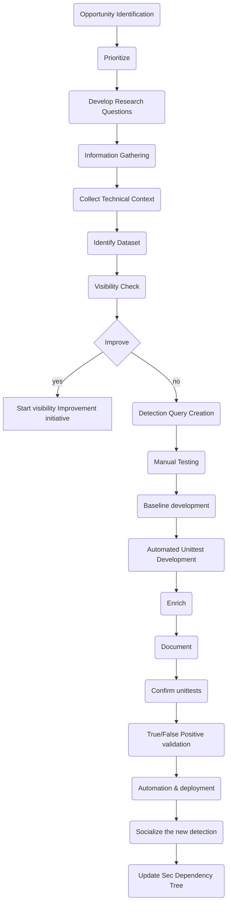

# The HUNT Library

Welcome to the Threat Hunting HUNTS library :wave:

## Goals

High-level goals for the HUNTS library:

1. Organize HUNTS in a structured format
2. Provide audit/log trail
3. Ensure continues vigilance for the covered TTPs
4. Automate manual searching and reduce the operational effort
5. Be the central repository of detections

## Hunt creation process

Standard as per the Sunrise phase:

