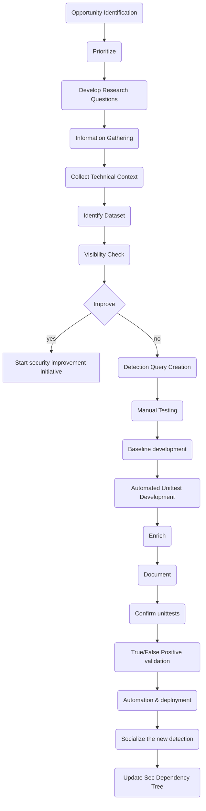
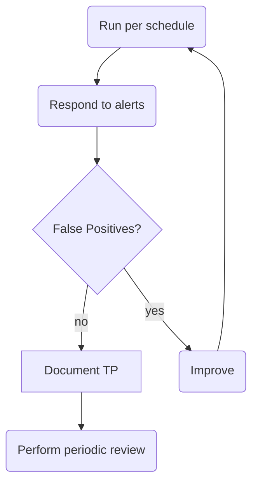
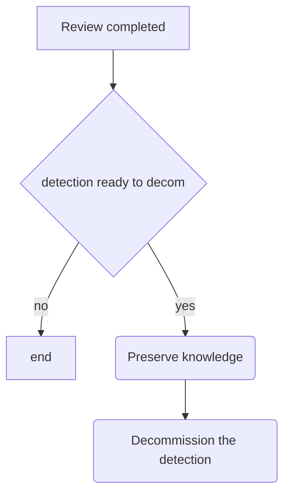
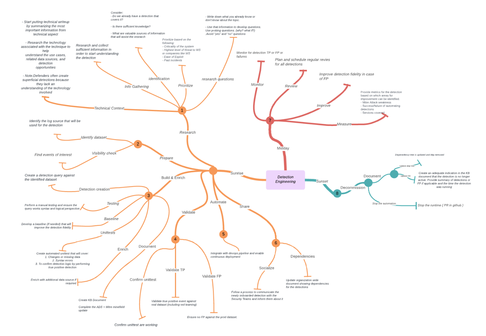

# Open Detection Engineering Framework - ODEF

## Introduction

The Framework focuses on using business goals and outcomes to drive and guide cybersecurity activities to deliver detections, improve visibility, minimize vendor dependencies and ultimately improve the organization security posture. The Framework in its core provides the principles that guide efficient and effective detection engineering practices and also provides three maturity levels to measure the organization performance.
Each phase of the framework’s core aims to describe the detection lifecycle and uses phase functions to focus the effort of the detection engineer and guide them through the process.
The three maturity levels provide a high level mechanism for organizations to view and evaluate their approach for detection engineering and focus on areas of improvement.
The Framework enables organizations – regardless of size, degree of cybersecurity risk, or cybersecurity sophistication – to apply the principles and best practices of detection engineering and to improve their security posture.

## High level goals

The framework high level goals are to:

<ul>
  <li>Provide guidance on how to be systematic, repeatable and predictable when building hunts and detections</li>
  <li>Ensure that high visibility is achieved throughout the organization </li>
  <li>Convert insights to retainable and actionable Knowledge and promote knowledge sharing </li>
  <li>Introduce continuous vigilance </li>
  <li>Introduce detection validation through testing </li>
  <li>Facilitate a knowledge driven environment</li>
</ul>

## Framework Core

The Framework Core provides a set of activities to achieve specific cybersecurity outcomes and references examples of how to achieve those outcomes.
The Core comprises three lifecycle phases: Sunrise, Midday, Sunset: These phases describe the life of a detection and the functions, guidelines and goals for each phase. Functions, goals, guidelines help the detection engineer to have north star focus and deliver a detection with exceptional quality.

### Phase 1️⃣ Sunrise 🌅

Sunrise is the first phase of the detection lifecycle. It marks the inception, development and deployment of the detection. During that phase there are 6 core functions that should be addressed:

<ul>
  <li>Research</li>
  <li>Prepare (Logging)</li>
  <li>Build (Detection Content)</li>
  <li>Validate</li>
  <li>Automate</li>
  <li>Share (Knowledge)</li>
</ul>

#### High level goals for the Sunrise phase

<ul>
  <li>Build high fidelity detection </li>
  <li>Ensure detection validation</li>
  <li>Create documentation </li>
  <li>Integrate and automate in the environment </li>
  <li>Socialize the detection with the security organization</li>
</ul>

<table class="tg">
<thead>
  <tr>
    <th class="tg-7btt">Functions</th>
    <th class="tg-7btt">Goal</th>
    <th class="tg-7btt">Description</th>
    <th class="tg-7btt">Guidelines</th>
  </tr>
</thead>
<tbody>
  <tr>
    <td class="tg-8bgf" rowspan="5">Research</td>
    <td class="tg-0pky">Opportunity Identification</td>
    <td class="tg-0pky">It can be triggered from analyzing threat intelligence reports, or OSINT, or internal knowledge for a particular security gap. Document the use case and the goals of the detection as part of the opportunity identification process. </td>
    <td class="tg-0pky">

- Document the use case that you’re building and set goals.
- Is the TTP already covered by an existing alert or detection?
- Is there sufficient knowledge to start building or additional research would be required?
- What are sources of information that will assist the research?

</td>
  </tr>
  <tr>
    <td class="tg-0lax">Prioritize</td>
    <td class="tg-0lax">Detection engineering work has to be prioritized and tracked. Work prioritization can be based on urgency and priority. Backlog of detections and security posture activities is desirable and recommended.
</td>
    <td class="tg-0pky">Prioritization criteria:

- Criticality of the system
- Highest level of threat to the organization
- Ease of Exploitation
- Past incidents</td>
  </tr>
  <tr>
    <td class="tg-0lax">Develop Research Questions</td>
    <td class="tg-0lax">Write your research questions that while answering you will gain understanding of the topic. </td>
    <td class="tg-0pky">Examples:

  - Write down what you already know or don't know about the topic.
  - Use that information to develop questions. Use probing questions. (why? what if?).
  - Avoid "yes" and "no" questions </td>
  </tr>
  
  <tr>
    <td class="tg-0lax">Information Gathering</td>
    <td class="tg-0lax">Research and collect sufficient information in order to start understanding the detection</td>
    <td class="tg-0pky">Provides a good overview of the topic if you are unfamiliar with it.

  - Identify important facts, dates, events, history, organizations, etc. (in case the detection is a response to a past incident.)
  - Find bibliographies which provide additional sources of information (include in the Appendix section detection document)

</td>
  </tr>

  <tr>
    <td class="tg-0lax">Technical Context</td>
    <td class="tg-0lax">Create and understand technical context around the detection</td>
    <td class="tg-0lax">
      <ul>
        <li> Start putting technical writeup by summarizing the most important information from technical aspect </li>
        <li> Research the technology associated with the technique to help understand the use cases, related data sources, and detection opportunities </li>
        <li> Note: Defenders often create superficial detections because they lack an understanding of the technology involved. In case of uncertainties it is best to engage the team or engineer responsible for the management of the technology</li>
      </ul>
</td>
  </tr>
  <tr>
    <td class="tg-0lax" rowspan="3">Prepare </td>
    <td class="tg-0lax">Identify Dataset</td>
    <td class="tg-0lax">Identify the log source that will be used for the detection</td>
    <td class="tg-0lax"><b>Know your environment</b>
      <ul>
        <li> Understand the data source and document it by creating a data dictionary.</li>
        <li> The data dictionary should grow and contain sources of data and their corresponding schemas. It can later be used to quickly refer to. </li>
      </ul>
</td>
  </tr>
  <tr>
    <td class="tg-0pky">Visibility Check</td>
    <td class="tg-0pky">Ensure there is sufficient logging, retention and visibility in order to successfully build the detection and satisfy the use case</td>
    <td class="tg-0pky">
      <ul>
        <li> Use the accumulated technical knowledge to identify source and identify the events required to build detection</li>
        <li> Use any historical events in order to validate that there is sufficient visibility </li>
      </ul>

</td>
  </tr>
  <tr>
    <td class="tg-0lax">Improve(optional)</td>
    <td class="tg-0lax">Once the data is explored we can identify opportunities for improvements such as:
      <ul>
        <li>Collecting additional logs or change logging levels </li>
        <li>Create additional attributes (parsing of raw logs)</li>
        <li>Consolidation of distinct logs</li>
      </ul>
</td>
    <td class="tg-0lax">Improvement initiatives and requests should be communicated to the responsible for the dataset in question team. For that purpose it makes sense to maintain a contact list that provides quick reference to technology, support/engineering teams and contact details.
</td>
  </tr>
  <tr>
    <td class="tg-8bgf" rowspan="6">Build &amp; Enrich</td>
    <td class="tg-0pky">Detection Creation</td>
    <td class="tg-0pky">Create a detection query against the identified dataset</td>
    <td class="tg-0pky">Having a good understanding of the technical context and the data source begin building queries to narrow down the data to actionable insight.</td>
  </tr>
  <tr>
    <td class="tg-0lax">Manual Testing</td>
    <td class="tg-0lax">Perform a manual testing and ensure the query works syntax and logical perspective</td>
    <td class="tg-0lax">
    <ul>
        <li>Ensure the query does not have any syntax errors</li>
        <li>In case the detection is build in response to past incident ensure that the query is indeed catching true positive events</li>
    </ul>
      </td>
  </tr>
  <tr>
    <td class="tg-0lax">Baseline development</td>
    <td class="tg-0lax">Develop a baseline (if needed) that will improve the detection fidelity</td>
    <td class="tg-0lax">
        <ul>
          <li>Baselines are sets of known and verified good behaviors and events present in the organization. Those events are normally excluded from the detection logic. </li>
          <li>Baselines decisions and considerations should be documented and clearly states in the ADS</li>
          <li>Baselines are included in the hunt.yml/tf/hcl or alert.yml/tf/hcl files</li>
        </ul>
    </td>
  </tr>
  <tr>
    <td class="tg-0lax">Unittest Development</td>
    <td class="tg-0lax">The unittest development is dependent on the type of devops pipeline. Simple goals are provided.
        </td>
    <td class="tg-0lax">Goals for the unittesting:
          <ul>
            <li>Changes or missing data</li>
            <li>Syntax errors </li>
            <li>To confirm detection logic by performing true positive detection</li>
        </ul></td>
  </tr>
  <tr>
    <td class="tg-0lax">Enrich</td>
    <td class="tg-0lax">Enrich with additional data source if required</td>
    <td class="tg-0lax">  
          <ul>
          <li>Each hunt could have different enrichment requirements. In some cases HR database could be used in order to understand if a person is on vacation, other trivial cases could be lookup of a hash, ip or domain in an threat intelligence repository etc.</li>
        </ul> </td>
  </tr>
  <tr>
    <td class="tg-0lax">Document</td>
    <td class="tg-0lax">
        <ul>
          <li>Create KB Document</li>
          <li>Complete the ADS </li>
          <li> Mitre minefield update</li>
        </ul>
        </td>
    <td class="tg-0lax">
    <ul>
          <li>Central knowledge base repository is required in order to mature the detection engineering program. This can be a github repository with controlled access that provides on a need to know basis the security teams members with access.</li>
          <li>Each hunt should have a corresponding <b>README.MD</b> file that provides sufficient information and context. Consider an SOC analyst or Incident Responder responding to an event from your detection. By looking at the documentation they should be easily briefed on the premise and technicalities of the detection. </li>
        </ul></td>
  </tr>
  <tr>
    <td class="tg-0lax" rowspan="3">Validate</td>
    <td class="tg-0pky">Confirm unittests</td>
    <td class="tg-0pky">Confirm unittest are working </td>
    <td class="tg-0pky">Confirmation of the unittests can be done by inspecting the implemented devops pipeline and ensuring that the actions (in the case of github) for unittests are running</td>
  </tr>
  <tr>
    <td class="tg-0lax">True Positive validation</td>
    <td class="tg-0lax">Validate true positive event against real dataset using the query developed earlier. </td>
    <td class="tg-0lax">
    True positive validation can be achieved by:
        <ul>
          <li>Using historical event that exists in the central data repository</li>
          <li>Emulation of the TTP by executing it in a controlled environment </li>
        </ul>
        </td>
  </tr>
  <tr>
    <td class="tg-0lax">False Positive Validation</td>
    <td class="tg-0lax">Ensure no FP are produced by the query when ran against the prod dataset. </td>
    <td class="tg-0lax">
      <ul>
          <li>False positive events are good known events which are produced as output results by the detection/hunt query. </li>
          <li>If baseline is used it should be validated that the baseline is catching those good known events.
          Splunk example:
          Splunk you can use <b>makeresult</b> command to create fake results and test your baseline and how you handle false positives. </li>
      </ul>
    </td>
  </tr>
  <tr>
    <td class="tg-8bgf">Automate</td>
    <td class="tg-0pky">Automation &amp; deployment</td>
    <td class="tg-0pky">This step is entirely dependant on the environment and should follow the standard ci/cd or automation practices of the organization. </td>
    <td class="tg-0pky">Integrate with devops pipeline and enable continuous deployment </td>
  </tr>
  <tr>
    <td class="tg-8bgf" rowspan="2">Share</td>
    <td class="tg-0lax">Socialize the new detection</td>
    <td class="tg-0lax">A notification process is required and it should be created. The process can be in the form of newsletter or slack channel notification, preferably automated one.</td>
    <td class="tg-0lax">Follow a process to communicate the newly created detection with the Security Teams and inform them about it</td>
  </tr>
  <tr>
    <td class="tg-0lax">Update Sec Dependency Tree</td>
    <td class="tg-0lax">This document is actually part of the repository and can be shared with data engineering and security teams. The goal of sharing it is to promote care mentality where teams would check before they change. Meaning, if data engineer is about to rename an index they should first check if the index is being used. Having dependency document as part of the repository makes it easy and seamless for them to check. </td>
    <td class="tg-0lax">Update organization wide document showing dependencies for the detections</td>
  </tr>
</tbody>
</table>

<h3>Sunrise phase Process Flow</h3>

#

### Phase 2️⃣ Midday ☀️

The “Midday” phase is normally the longest phase from the detection lifecycle, during which the detection has been engineered and commissioned to production. The phase monitors the detection during its operation and aims to improve it if needed.
High level goals for the Midday phase:

<ul>
  <li>Operate and monitor the detection for FP or TP </li>
  <li>Improve the detection logic in case of influx of FP </li>
  <li>Perform systematic reviews to ensure relevancy </li>
</ul>
<table>
<thead>
  <tr>
    <th><b>Functions</b></th>
    <th><b>Goal</b></th>
    <th><b>Description</b></th>
    <th><b>Guidelines</b></th>
  </tr>
</thead>
<tbody>
  <tr>
    <td rowspan="3">Monitor</td>
    <td>Run as per defined schedule</td>
    <td>Detection is configured to run on pre-defined schedule or real time if applicable</td>
    <td>Detections will run based on the schedule set during the sunrise phase. </td>
  </tr>
  <tr>
    <td>Confirm unittest passing </td>
    <td>Monitoring is configured to notify the responsible team in case the automation for the detection is not running properly</td>
    <td>Suggested approach: github actions - before deployment ensuring proper syntax </td>
  </tr>
  <tr>
    <td>Work detections</td>
    <td>Once detection is running it should be monitored for any TP or potential influx of FP</td>
    <td>TP events should be triaged, investigated and responded on by following an agreed IR process.  FP events should be investigated, proved as FP and documented as part of the baseline. Once the baseline is changed in the documentation the query can be updated and improved. </td>
  </tr>
  <tr>
    <td>Measure </td>
    <td>Measure detection efficacy </td>
    <td>Enable metrics for the detection based on which areas for improvement can be identified.  Mitre Attack weakness Success/failure of automating detections Services covered </td>
    <td>Each detection that covers particular TTP can be marked in the Mitre ATT&amp;CK Navigator. Looking at percentage of covered tactics and techniques can be a metric.  Success or Failure in detection automation or influx of FP metric can be used to identify detections that require improvement.  Detection runtime length is a metric which can identify poorly written queries. For example, query too open that collects way too many events and chunks too much data only to spend even more time to filter by using custom logic. </td>
  </tr>
  <tr>
    <td>Improve (optional)</td>
    <td>Improve detection fidelity</td>
    <td>Once improvement opportunities have been identified during the operations or periodic review an improvement is triggered </td>
    <td>The goal of this function is to improve any detections which are with poor health (slow runtime, causing errors) and improve them by revisiting the detention logic. </td>
  </tr>
  <tr>
    <td>Review </td>
    <td>Perform periodic review</td>
    <td>Review detections to identify improvement opportunities or decommission requirements</td>
    <td>Detection can become irrelevant and thus decommissioned whe:  The risk that it is compensating is far smaller than the cost of running the detection The technology used for the detection is no longer present in the company  </td>
  </tr>
</tbody>
</table>

<h3>Midday phase Process Flow</h3>

#

### Phase 3️⃣ Sunset 🌆

During the “Sunset” phase the detection is taken out of commission. The phase wants to ensure that resources are not spent for outdated detections that are no longer applicable and at the same time leave sufficient trace of the existence of the detection.

High level goals for the Sunset phase:
<ul>
  <li>Decommission the detection and leave it in a state that it can be resumed anytime
  <li>Preserve knowledge
</ul>

<table>
<thead>
  <tr>
    <th>Functions</th>
    <th>Goal</th>
    <th>Description</th>
    <th>Guidelines</th>
  </tr>
</thead>
<tbody>
  <tr>
    <td rowspan="2">Decommission</td>
    <td>Decommission the detection</td>
    <td>The goal is to decommission the detection by following process that provides visibility </td>
    <td>In order to decommission a detection simply change the status field to "Sunset" in the .yml file. Assuming your devops pipeline is configured correctly, this should effectively disable the detections and prevent it from running.
     Note: Do not remove anything from the repository as detections can be reused in future. </td>
  </tr>
  <tr>
    <td>Knowledge base update</td>
    <td>Create an adequate indication in the KB document that the detection is no longer active and socialize the change with your security teams.</td>
    <td>Update Mitre coverage map by removing the coverage that the detection was providing</td>
  </tr>
</tbody>
</table>

<h3>Sunset phase Process Flow</h3>

# Detection Engineering Maturity Model (DEMM)

Maturity is strictly a self-evaluation process by the team, the framework just provides some guidance and structure and assures that all of the relevant areas are covered. This review process gives a baseline, it helps the teams to create a common understanding about their way of working, and it also helps to figure out where to start any improvement activities. The self assessment is in no way calibrated.

## Maturity Levels

### Level 1 - **Partial**

- Threat Detection Content
  - Organizational threat identification practices rely solely on external vendors to provide security content.
  - Assurance and context around alerts and detections is not provided or sufficient.
  - Risk is managed in an ad hoc and often reactive manner by relying on third parties.
- Assurance
  - There is some limited awareness of cybersecurity threat detection capabilities at the organizational level.
  - The organization implements threat validation and verification on an irregular, case-by-case basis due to varied experience or information gained from outside sources.
  - Assurance through continuous validation is not present.
- Knowledge sharing
  - The organization may not have processes to enable cybersecurity information sharing.
  - Documentation is rarely written and shared only on ad-hoc basis and it is scattered across teams.

### Level 2 - **Adequate**

* Threat Detection Content
  - Organizational threat identification practices rely on internal teams and external vendors to provide security content.
  - Context around alerts and detections is provided. Specialized teams are able to introduce new detections and security content.
  - Some security teams have a better understanding of security posture than others.
- Assurance
  - There is some awareness of cybersecurity threat detection capabilities as the organization is now building custom detections to compensate for gaps.
  - The custom detections are use case driven and validated during the detection development process.
  - Continuous validation is not enabled and the organization still relies on suppliers for most of the detection capabilities.
- Knowledge sharing
  - The organization is starting to enable knowledge sharing and promotes documentation efforts.
  - There is a central detection information repository.

### Level 3 - **Enabled (Proactive)**

* Threat Detection Content
  - Organization maintains continuous practices that provide excellent internal insights and knowledge. Context around alerts and detections is provided.
  - Any team is encouraged and capable to introduce new detection components and thus improve the security posture.
  - The security posture of the environment is well understood across the security teams.
- Assurance
  - The organization possesses a detection coverage map and covers a big percentage with in-house built detections. The organization does not rely on vendors to provide security content.
  - Automation is provided to continuously validate and run the detection use cases.
  - Additional assurance is achieved by running red team exercises and automation frameworks.
- Knowledge sharing
  - Organizations possess practices to create and maintain high quality records and appropriately control and manage the access to the information.
  - Processes for socializing detections are automated and teams are informed of the development of new detections.

## Operational Maturity

### Maturity Review Process (MRP)

The process of evaluating the maturity:

<ul>
  <li><b>Collect</b> - Collect information about your processes,people and tools. Identify changes to any. The goal is to gain a holistic understanding of the organization's security teams, tools and processes. Based on that information various posture improvements can be identified.
</li>
  <li><b>Analize</b> - Based on the data that you have collected and find the corresponding maturity level. Finding where in the maturity level the organization is important for understanding the impact and importance of each identified security improvement initiative and thus prioritize accordingly.
</li>
  <li><b>Prioritize</b> - Prioritize and decide which is the next low hanging fruit that can be improved. Not all security issues are equally important, prioritization should focus on those initiatives that influence and change the security posture and introduce the most maturity.
</li>
  <li><b>Improve</b> - Create an initiative or a project for improving the identified gap. </li>
</ul>

### Security Improvement Initiative

Security improvement initiatives are likely outcomes of the MRP process. The goal of the security improvement initiative is to address identified visibility gaps in the organization's security posture. For example, during the review process or detection engineering we may identify that our application is not providing sufficient logging in order to detect particular behavior or ttp of interest. That is a good candidate for a security improvement initiative. The goal of the initiative would be to deliver the visibility needed and notify back the Detection Engineer so that they can proceed with the detection creation. Depending on the size of the organization and internal processes, this process might be driven by the Detection Engineer or completely separate team.

### DEMM Cadence

Evaluating the maturity of the organization and striving to improve it is no one time effort or activity. For that best results can be achieved by:

  <li> Set a regular schedule for reevaluating and revisiting the DEMM. </li>
  <li> Ensure that the security improvement initiatives are targeted with a timeline and aligned with the overall organizational security strategy. </li>
</ul>

## Framework Mindmap

