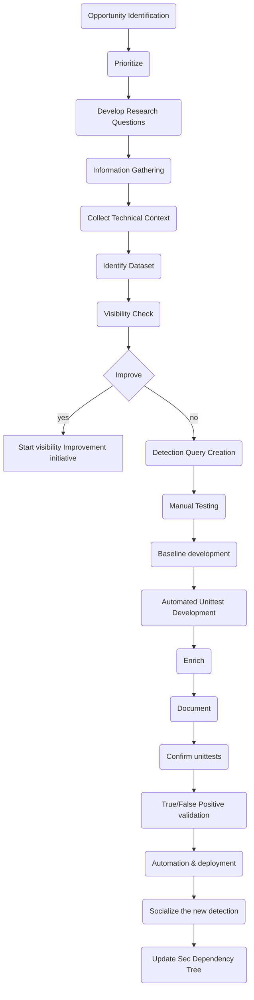

# The HUNT Library 

Welcome to the Threat Hunting HUNTS library :wave: 
#
## Goals

High-level goals for the HUNTS library: 
<ol>
  <li>Organize HUNTS in a structured format</li>
  <li>Provide audit/log trail</li>
  <li>Ensure continues vigilance for the covered TTPs</li>
  <li>Automate manual searching and reduce the operational effort</li>
  <li>Be the central repository of detections</li>
</ol>

## Hunt creation process

Standard as per the Sunrise phase:

